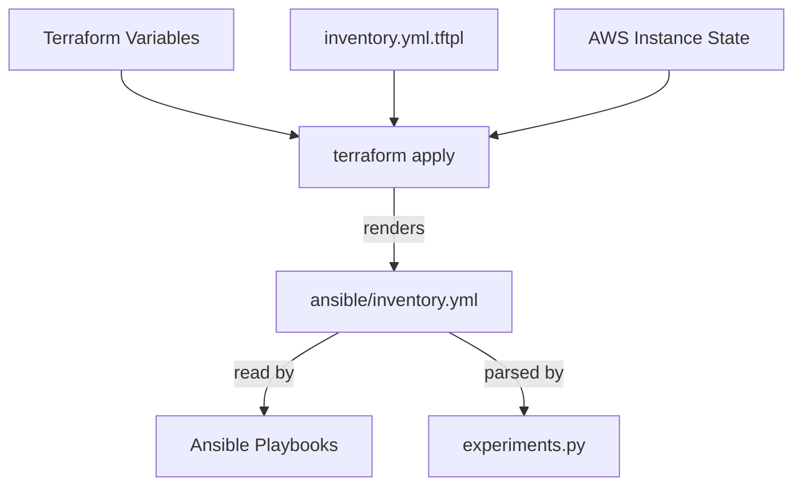

# How Ansible Inventory is Created

This document explains the automated process of generating the Ansible inventory for the MGR project. The inventory is the "glue" that connects the infrastructure provisioned by Terraform with the configuration management and experiment orchestration handled by Ansible and Python scripts.

## Overview

The Ansible inventory is **not** managed manually. Instead, it is dynamically generated by **Terraform** every time the infrastructure is applied or updated. This ensures that IP addresses, DNS names, and scenario-specific metadata are always in sync with the actual AWS resources.



## The Generation Pipeline

### 1. The Template
The source of the inventory structure is a Terraform template file located at:
`terraform/templates/inventory.yml.tftpl`

This template uses Terraform's template syntax (`%{ for ... }`) to iterate over the provisioned EC2 instances and the defined test scenarios.

### 2. The Resource
The actual file generation is handled by a `local_file` resource in:
`terraform/07_inventory.tf`

```hcl
resource "local_file" "ansible_inventory" {
  content = templatefile("${path.module}/templates/inventory.yml.tftpl", {
    app_servers       = aws_instance.app_server
    load_generators   = aws_instance.load_generator
    monitoring_server = aws_instance.monitoring_server
    ssh_user          = "ec2-user"
    private_key_path  = "~/.ssh/MGR1.pem"
    test_scenarios    = var.test_scenarios
  })
  filename = "${path.module}/../ansible/inventory.yml"
}
```

### 3. Output Location
The generated file is saved to:
`ansible/inventory.yml`

> [!IMPORTANT]
> Do **not** edit `ansible/inventory.yml` manually. Any changes will be overwritten the next time `terraform apply` is executed. If you need to change the inventory structure, modify the template in `terraform/templates/`.

## Inventory Structure

The inventory is organized into functional groups to allow precise targeting of roles and scenarios:

| Group Name | Purpose |
| :--- | :--- |
| `role_app_servers` | Parent group containing all application server sub-groups. |
| `app_server_{scenario}` | Specific group for a framework (e.g., `app_server_fastify`). Contains the host and variables like `app_dir`. |
| `role_load_generators` | Parent group for all load generator sub-groups. |
| `role_load_generator_{scenario}`| Specific group for the load generator attacking a corresponding app server. |
| `role_monitoring_server` | Group containing the Prometheus/Grafana monitoring host. |

### Host Variables
Each host in the inventory is enriched with metadata extracted from AWS:
- `ansible_host`: The public IP (used for SSH connectivity).
- `private_ip`: Used for internal communication between Load Generators and App Servers.
- `public_ip`: For external access.
- `scenario_type`: Identifies the framework being tested.

## Consumption

### 1. Ansible
Playbooks use these groups to target specific tiers. For example, `site.yml` applies roles based on `role_app_servers` or `role_monitoring_server`.

### 2. Orchestrator (`experiments.py`)
The Python orchestrator parses `inventory.yml` at the start of an experiment to:
- Discover which scenarios are currently active (based on which `app_server_` groups exist).
- Map application servers to their corresponding load generator groups.
- Retrieve the private IPs of the app servers to pass them to the load testing tools (k6/wrk).

## Troubleshooting

If `ansible/inventory.yml` is missing or contains incorrect IPs:
1. Ensure you have run `terraform apply`.
2. Check that the `test_scenarios` variable in Terraform includes the scenarios you expect.
3. Verify that the EC2 instances were successfully created and have assigned IPs.
